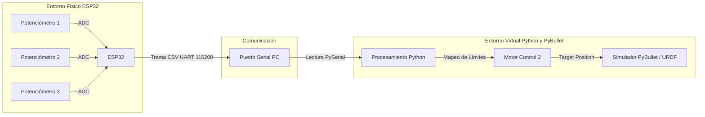
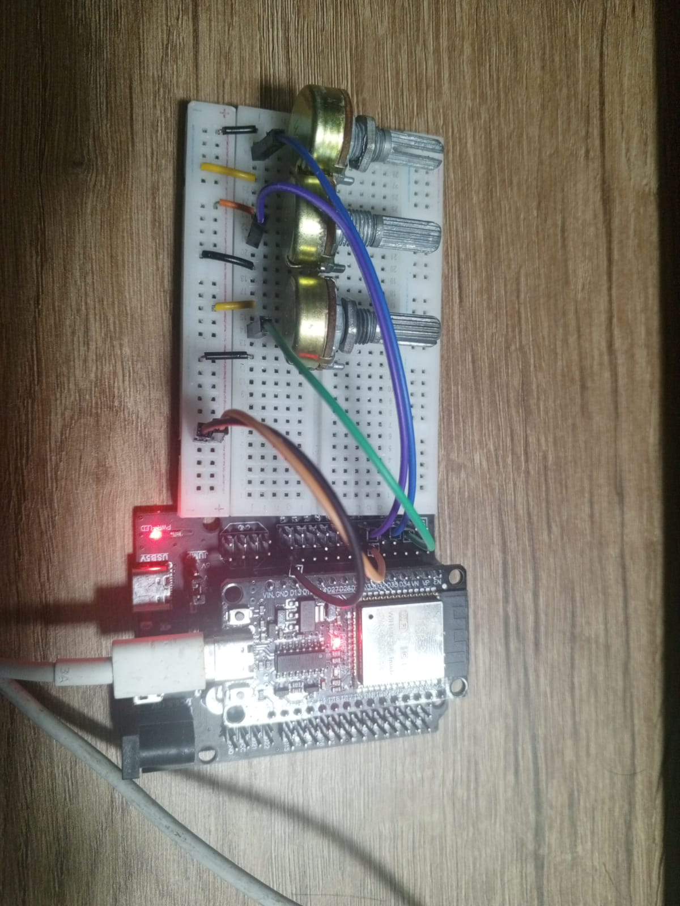
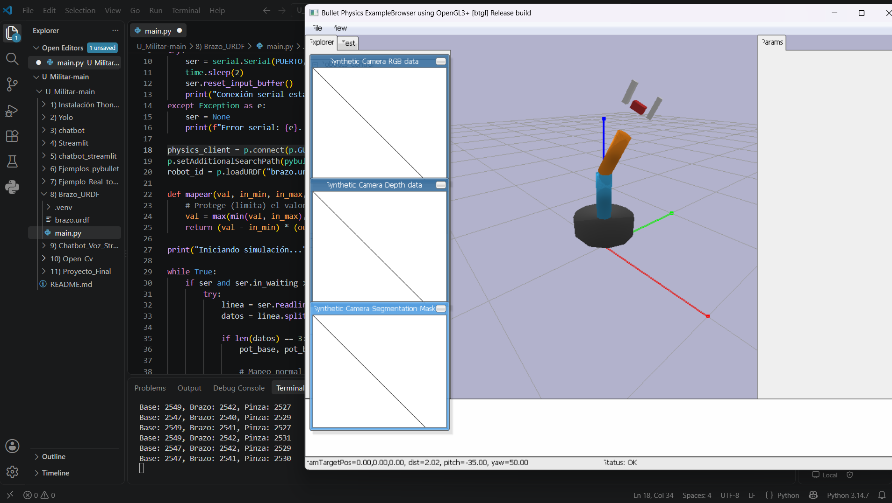
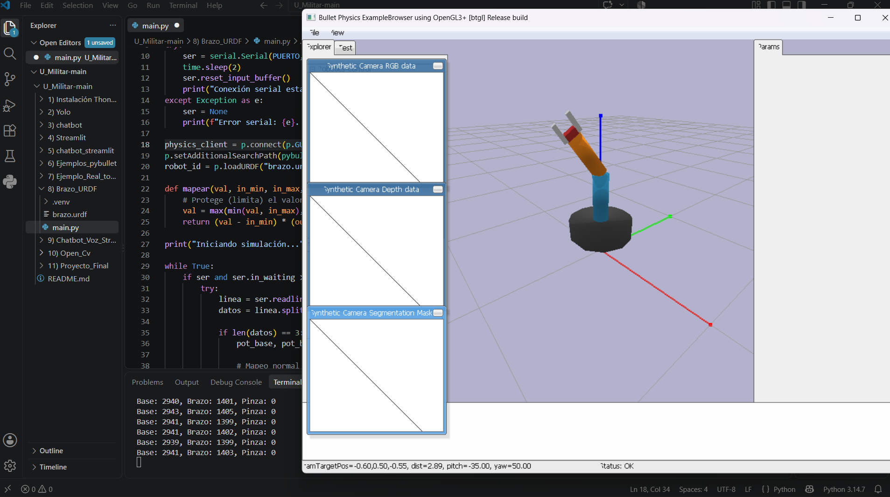

# Control de Brazo Robótico (URDF) mediante ESP32 y PyBullet

**Estudiante:** Johan Andrés Canchala Arenas  
**Asignatura:** Microcontroladores
**Universidad:** Universidad Militar Nueva Granada  

---

## 1. Descripción General del Proyecto

Este proyecto consiste en el control de un brazo robótico simulado en un entorno 3D (**PyBullet**) a partir de datos analógicos físicos capturados por un microcontrolador **ESP32**. 

El sistema utiliza tres potenciómetros para leer la intención de movimiento del usuario. Estos valores se envían por comunicación Serial (UART) a un script en Python que los mapea y actualiza la posición de las articulaciones de un modelo URDF en tiempo real.

---

## 2. Diagrama de Bloques y Flujo de Datos



## 3. Mapeo de Hardware y Articulaciones

El modelo URDF proporcionado cuenta con una base giratoria, un eslabón de elevación y una pinza con dos dedos simétricos. El mapeo físico-virtual es el siguiente:

| Sensor Físico | Pin ESP32 (ADC) | Articulación URDF | Tipo de Movimiento | Rango Mapeado |
| :--- | :---: | :--- | :--- | :--- |
| **Potenciómetro 1 (Base)** | GPIO 35 | `joint_1` (Base) | Rotación (Revolute) | -2.5 a 2.5 radianes |
| **Potenciómetro 2 (Brazo)** | GPIO 33 | `joint_2` (Brazo) | Elevación (Revolute) | -2.0 a 2.0 radianes |
| **Potenciómetro 3 (Pinza)** | GPIO 34 | `joint_gripper` / Dedos | Apertura (Prismatic) | 0.0 a 0.05 metros |

*Nota: La lectura de los potenciómetros (rango 0 - 4095 del ADC del ESP32) se escala linealmente a los límites físicos declarados en las etiquetas `<limit>` del archivo XML del URDF.*

---

## 4. Evidencias de Funcionamiento

### 4.1 Registro Fotográfico del Montaje

| Montaje General del Circuito (ESP32 + Potenciómetros) |
| :---: |
|  |
| *Conexión de los potenciómetros a los pines de conversión analógica-digital del ESP32.* |

| Simulación en PyBullet (Posicionamiento) | Simulación en PyBullet (Pinza Cerrada) |
| :---: | :---: |
|  |  |
| *Respuesta del modelo URDF en tiempo real al giro de los sensores físicos.* | *Cierre de los eslabones prismáticos controlados por el tercer potenciómetro.* |

### 4.2 Video Demostrativo

En el siguiente video se valida la comunicación en tiempo real y la sincronización entre el movimiento físico de los sensores analógicos y las articulaciones del robot en la simulación:

▶️ **[VER VIDEO DEMOSTRATIVO DEL EJERCICIO](https://videotourl.com/videos/1790303712417-382f3ef7-bbc2-4fa1-a31d-739283d78a77.mp4)**

---

## 5. Estructura del Proyecto

```text
├── Firmware_ESP32/
│   └── Firmware_ESP32.ino   # Código C++ para lectura ADC y transmisión UART
├── Script_Python/
│   ├── main.py              # Script principal (PyBullet + PySerial)
│   └── brazo.urdf           # Modelo cinemático del robot proporcionado
├── img/                     # Evidencias fotográficas
│   ├── Montaje.jpg
│   ├── Pinza_Cerrada.png
│   └── Posiciones_2500.png
└── README.md                # Este documento
```
